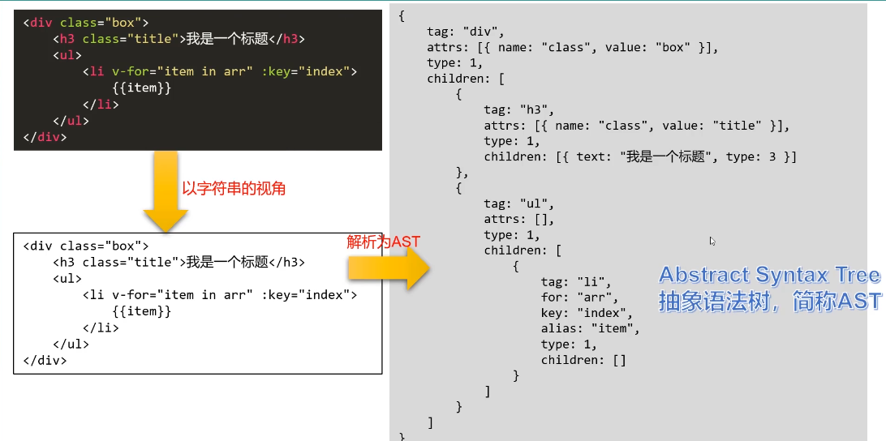
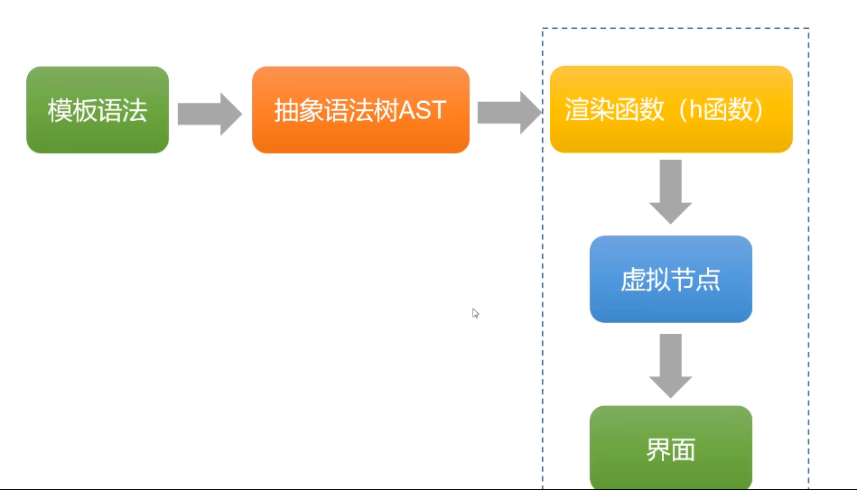
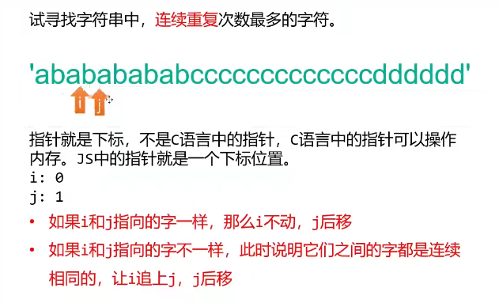
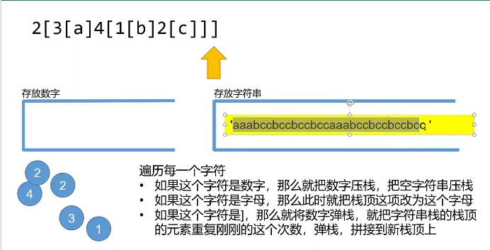
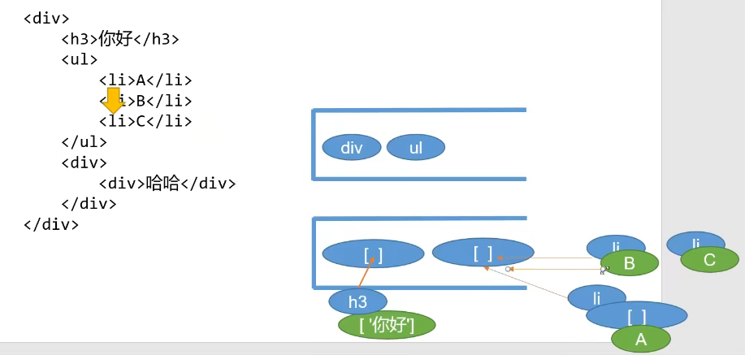
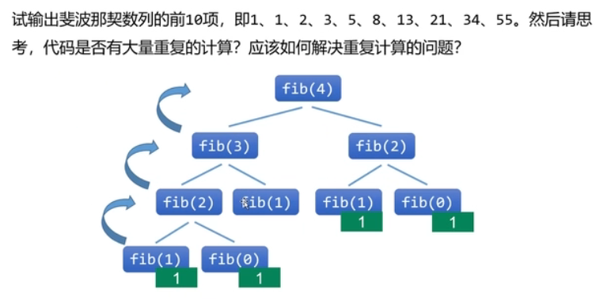

### AST抽象语法树

> 模板语法  ======通过抽象语法树AST进行过渡=====>> 正常的HTML语法

> 本质上是一个JS对象

>使用算法：指针、栈、递归

### 指针

下标位置。

### 栈

> 运用正则匹配开始标记, 结束标记,文字内容

> 利用一个指针和两个栈,循环template标签中的字符串, 拆分出开始和结束,以及文字, 形成js对象

### 递归

